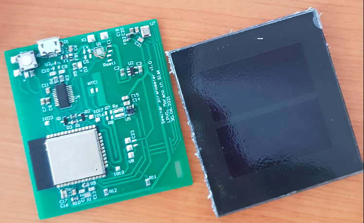
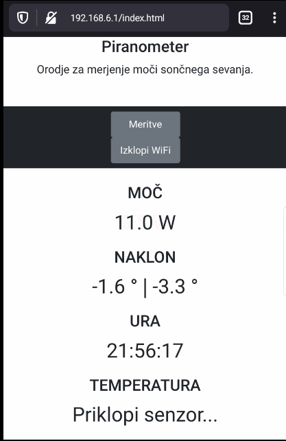

# Pyranometer

A tool based on ESP32 used for measuring the solar irradiance with option to measure the device inclination and the ambient temperature.

<!---->

## Application

Application is based on the FreeRTOS and is build using [Platformio](https://platformio.org/). 

Main script is located in:

> src/

Custom libraries and drivers are located in:

> lib/

Frontend application is located in folder:

> data/

 

## GUI example:

<!--  -->